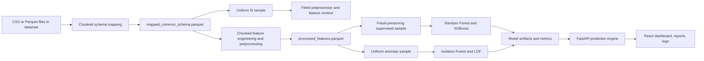

# Hybrid Anomaly Detection for Identifying Ambiguous UPI Transactions

## 1. Project purpose

This repository implements an offline, batch-processing research system for post-transaction analysis of digital-payment records. Its stated research objective is to retain two independent signals:

- A supervised signal that estimates whether a transaction resembles labelled fraud.
- An unsupervised signal that estimates how unusual a transaction is relative to the anomaly-model training distribution.

The React dashboard also applies a transparent research fusion calculation that assigns one of three research resolutions:

- `LIKELY_LEGITIMATE`
- `FRAUD_LIKELY`
- `AMBIGUOUS_REVIEW`

The code explicitly states that this is not a real-time prevention system, payment gateway, banking integration, approval/decline engine, or proof of fraud. The FastAPI service is local-only and exists to let the Vite React dashboard invoke Python model artifacts.

## 2. Current repository state

The checked-in/generated artifact metadata records the following completed pipeline state:

| Item | Current value |
|---|---:|
| Mapped records | 7,218,220 |
| Processed records | 7,218,220 |
| Rows removed during mapping | 0 |
| Rows removed during preprocessing | 0 |
| Fraud-labelled records | 28,876 |
| Legitimate-labelled records | 7,189,344 |
| Population fraud rate | 0.0040004322 (about 0.4000%) |
| Mapped Parquet chunks | 74 |
| Processed Parquet chunks | 73 |

These values come from `reports/pipeline_row_counts.json` and `models/fraud_probability_calibration.json`. They describe the generated local artifacts and will change after retraining with different input files or settings.

## 3. Technology stack

### Python and machine learning

| Technology | Role in the codebase |
|---|---|
| Python 3.11 target | Project language stated in the project specification. |
| pandas, NumPy | Tabular transformation, aggregation, sampling, numerical operations. |
| PyArrow | Chunked Parquet reading/writing through `ParquetFile.iter_batches` and `ParquetWriter`. |
| scikit-learn | Imputation, encoding, scaling, Random Forest, Isolation Forest, LOF, metrics, train/test split. |
| XGBoost | `XGBClassifier` supervised fraud model. |
| joblib | Persists models, preprocessors, and historical feature context. |
| Matplotlib, Seaborn | Model report images: feature importance, ROC curves, confusion matrices, anomaly charts. |
| Plotly, Streamlit | Legacy local dashboard. |
| FastAPI, Pydantic, Uvicorn | Local backend for the React application. |

Exact pinned Python dependencies are in `requirements.txt`.

### Frontend

| Technology | Role |
|---|---|
| React 19 | Single-page testing dashboard. |
| Vite 6 | Development server and React build tool. |
| lucide-react | UI icons. |
| Browser `localStorage` | Persists up to 25 prediction-log entries locally in the browser. |

The Vite dev server runs on port `5173` and proxies `/api/*` to `http://127.0.0.1:8000/*`.

## 4. Repository layout

```text
upi-fraud-detection/
|- api/
|  |- main.py                    FastAPI local testing API
|- app/
|  |- app.py                     Streamlit entry point
|  |- dashboard.py               Legacy Streamlit UI
|  `- prediction_engine.py       Loads artifacts and runs manual predictions
|- data/
|  |- raw/                       Downloaded source datasets; ignored by Git
|  |- merged/                    Unified mapped Parquet/CSV artifacts
|  `- processed/                 Processed features and anomaly-score CSVs
|- frontend/
|  |- src/main.jsx               React dashboard and all page components
|  |- src/styles.css             Dashboard styling
|  |- vite.config.js             Development proxy configuration
|  `- package.json               Frontend scripts and dependencies
|- models/                       Serialized model/preprocessor/context artifacts
|- notebooks/                    Exploratory/legacy notebooks
|- reports/                      Metrics JSON and generated PNG reports
|- src/
|  |- data_loader.py             Non-streaming discovery/loading helpers
|  |- schema_mapping.py          Common schema and source mapping rules
|  |- data_preprocessing.py      Reusable fitted preprocessing class
|  |- feature_engineering.py     Transaction feature and history-context logic
|  |- parquet_pipeline.py        Chunked Parquet conversion/preprocessing/sampling
|  |- parquet_stats.py           Streaming label counter
|  |- sampling.py                In-memory sampling helpers
|  |- supervised_model.py        Random Forest/XGBoost training and evaluation
|  |- anomaly_detection.py       Isolation Forest/LOF training and scoring
|  |- probability_calibration.py Population-prior probability correction
|  |- fusion_model.py            Transparent fusion and research report logic
|  `- utils.py                   Paths, logging, serialization, shared helpers
|- main.py                       Batch pipeline CLI entry point
|- Pipeline.md                   Parquet/chunk-processing notes
|- RUN_COMMANDS.md               Command reference
|- README.md                     Short project overview
`- DOCUMENTATION.md              This document
```

## 5. Source datasets and unified schema

The repository is designed for four approved source datasets placed under `data/raw/`:

1. PaySim Dataset (Kaggle)
2. UPI Transaction 2024 (Kaggle)
3. IEEE Fraud Detection (Kaggle)
4. Digital Payment Transactions (Zenodo)

`src.schema_mapping` detects a dataset from filename and/or recognizable columns, then maps source fields into this common schema:

| Common field | Meaning in the project |
|---|---|
| `transaction_id` | Stable globally unique identifier generated from source, raw identifier context, and row offset. |
| `timestamp` | Parsed transaction time. |
| `amount` | Numeric transaction amount. |
| `sender_id` | Payer/sender/customer identifier when available. |
| `receiver_id` | Payee/receiver/merchant identifier when available. |
| `device_type` | Device/product channel when available. |
| `merchant_category` | Merchant/category/product code when available. |
| `location` | City/state/country/address-like value when available. |
| `transaction_type` | Source operation/type field. |
| `fraud_label` | Binary target: `1` fraud, `0` legitimate/default. |

### Mapping details actually implemented

- Column matching is case/format tolerant. It normalizes aliases such as `TransactionAmt`, `amount_inr`, `isFraud`, `nameOrig`, and `nameDest`.
- PaySim `step` is interpreted as hours after `2024-01-01`; PaySim `type` becomes `transaction_type`; device and location are set to `Unknown`; merchant category is set to transaction type.
- IEEE `TransactionDT` is interpreted as seconds after `2024-01-01`; `ProductCD` becomes both transaction type and merchant category; `DeviceType` maps to device; `addr1` maps to location.
- Missing textual fields become `Unknown`; missing timestamps become `NaT` during mapping and later receive preprocessing defaults; an unavailable fraud label becomes `0`.
- Fraud text labels such as `yes`, `true`, `fraud`, and `fraudulent` are converted to `1`; `no`, `false`, `legitimate`, and `normal` become `0`.
- Amount text is stripped to numeric characters before numeric conversion.
- Duplicate transaction IDs are validation failures; the normal ID construction is intended to avoid collisions across sources and chunks.

`transaction_type` is preserved because it is a source-data feature. In this mixed-dataset project, values such as `TRANSFER`, `PAYMENT`, `CASH_OUT`, `DEBIT`, or product codes are operation categories from the source datasets, not a claim that every category is a native UPI rail operation.

## 6. Batch architecture and data flow



The five pipeline stages printed by `main.py` are:

1. Convert raw datasets to unified, Snappy-compressed mapped Parquet.
2. Fit preprocessing state once and stream mapped rows into processed Parquet.
3. Feature engineering is performed during the streaming preprocessing stage.
4. Train supervised models from a bounded fraud-preserving sample.
5. Train anomaly models from a bounded uniform sample.

### Chunked Parquet behaviour

- Default chunk size: `100000` rows.
- Default preprocessing fit sample: `100000` rows.
- Parquet output compression: Snappy.
- The code reads Parquet with `pyarrow.parquet.ParquetFile.iter_batches` and writes one row group per chunk.
- CSV input is read with `pandas.read_csv(..., chunksize=...)`, selecting only source fields needed to form the common schema.
- Mapped and processed stages count `rows_read`, `rows_removed`, and `rows_written`; the current implementation does not intentionally drop rows.
- The raw/mapped data are not all materialized at once by the main Parquet pipeline. Bounded samples are materialized for preprocessor fitting and batch model training.

The models used here are batch estimators. The pipeline does not call `fit()` on each chunk because that would not constitute correct cumulative training for the configured models.

## 7. Preprocessing

The reusable implementation is `UPITransactionPreprocessor` in `src.data_preprocessing`.

### Fit-time operations

1. Verify common-schema fields when they are present.
2. Reject duplicate `transaction_id` values.
3. Normalize timestamps with `safe_datetime`.
4. Fill missing values.
5. Learn numeric outlier bounds from the fit sample.
6. Remove target, transaction ID, and timestamp from the model matrix.
7. Detect numeric, low-cardinality categorical, and high-cardinality categorical columns.
8. Fit imputers, scalers, encoders, and label encoders.

### Missing values

- Numeric: median of valid values, or `0.0` if the column has no valid values.
- Datetime: `2024-01-01`.
- Categorical: `Unknown`; categorical dtypes have `Unknown` added as a category before filling.

### Outlier clipping

For each eligible numeric feature, the fit-time lower and upper limits are:

```text
lower = quantile(1 - q)
upper = quantile(q)
q = 0.995 by default
```

So the default clipping range is the 0.5th to 99.5th percentile. Transform-time data use the already fitted bounds; they do not learn fresh per-chunk bounds.

### Encoding and scaling

The default configuration is `RobustScaler` plus mixed encoding.

- Numeric fields: `SimpleImputer(strategy="median")`, then the selected scaler.
- Low-cardinality categoricals: `SimpleImputer(strategy="most_frequent")`, then `OneHotEncoder(handle_unknown="ignore", sparse_output=False)`.
- High-cardinality categoricals: separate `LabelEncoder` instances.
- Low-cardinality threshold: 50 unique values.
- The implementation also supports `StandardScaler`, `MinMaxScaler`, and label-only encoding through `PreprocessingConfig`.

For RobustScaler, the transformed form is conceptually:

```text
x_scaled = (x - median(x)) / IQR(x)
```

where IQR is the interquartile range fitted from the preprocessing sample.

Unknown one-hot values become all-zero for that encoded field because `handle_unknown="ignore"`. Unknown high-cardinality values are converted to `Unknown` when that label exists, otherwise to the first learnt class.

## 8. Feature engineering

`src.feature_engineering.engineer_features` validates the schema and creates temporal, behavioural, velocity, and risk features. It produces 25 columns in the current code path, including the original common-schema columns.

### Temporal features

| Feature | Calculation |
|---|---|
| `hour_of_day` | `timestamp.hour` in `[0, 23]` |
| `day_of_week` | `timestamp.dayofweek` in `[0, 6]`, where Monday is 0 |
| `is_weekend` | `1` when day is Saturday or Sunday, else `0` |

### Behavioural features

Computed by sender within the currently engineered data frame/chunk:

| Feature | Calculation |
|---|---|
| `avg_transaction_amount` | Mean amount for the sender |
| `transaction_frequency` | Count of sender transaction IDs |
| `merchant_diversity` | Number of distinct merchant categories for the sender |
| `device_switching_frequency` | Number of distinct device types for the sender |
| `transactions_per_hour` | Count for `(sender_id, hour_of_day)` |

### Velocity features

Rows are sorted by sender and timestamp before these calculations.

```text
minutes_since_previous_sender_txn =
    (current_timestamp - previous_sender_timestamp) / 60 seconds

rapid_transactions = 1 when minutes_since_previous_sender_txn <= 5

amount_spike = 1 when amount > sender_mean + 3 * sender_standard_deviation

high_frequency_payments = 1 when transactions_per_hour >= max(2, P95(transactions_per_hour))
```

The first sender event has no previous timestamp and is not marked rapid.

### Risk features

| Feature | Calculation |
|---|---|
| `unusual_transaction_timing` | `1` for hour 00:00 through 05:00 inclusive |
| `new_payee_flag` | `1` for the first `(sender_id, receiver_id)` pair encountered in the engineered frame |
| `unusual_location_flag` | `1` when the current location differs from the sender's most frequent location in the engineered frame |

### Manual prediction history context

A manual UI submission has one row, so calculating sender history from it would incorrectly give values such as frequency `1` and diversity `1`. During preprocessing, the code builds and saves `models/feature_context.pkl` from the uniform fit sample. At prediction time, it replaces one-row behavioural defaults with this saved reference context:

- sender average and standard deviation of amount
- transaction frequency
- merchant and device diversity
- sender/hour count
- known sender-receiver pairs
- sender's usual location
- global mean amount and 95th percentile hourly frequency

For a sender absent from the context, the code falls back to global/zero defaults. The context is sampled, not a complete persistent transaction-history database.

## 9. Sampling and class imbalance

### Supervised training sample

The default CLI requests up to 500,000 supervised rows with a legitimate ratio of 3.0. The Parquet sampler:

1. Counts labels while streaming.
2. Preserves all fraud rows while the limit permits it.
3. Selects legitimate rows up to:

```text
min(total_legitimate,
    max_rows - selected_fraud,
    round(selected_fraud * legitimate_ratio))
```

4. Allocates legitimate selections proportionally across available `hour_of_day` and `day_of_week` strata.

The in-memory helper additionally supports stratification by available hour, day, transaction type, and device type.

### Anomaly training sample

The main pipeline uses a uniform, label-independent sample, defaulting to 200,000 rows. This avoids intentionally making an unsupervised detector learn a class-balanced distribution.

### Reproducibility

The sampling and train/test split use `random_state=42` by default.

## 10. Supervised fraud detection

`src.supervised_model` trains two classifiers with an 80/20 stratified train/test split when both classes are available.

### Random Forest

```text
RandomForestClassifier(
    n_estimators=250,
    class_weight="balanced",
    random_state=42,
    n_jobs=-1
)
```

### XGBoost

```text
XGBClassifier(
    n_estimators=250,
    max_depth=5,
    learning_rate=0.06,
    subsample=0.9,
    colsample_bytree=0.9,
    eval_metric="logloss",
    scale_pos_weight=negative_training_rows / positive_training_rows,
    random_state=42,
    n_jobs=-1
)
```

The raw classifier result is:

```text
raw_fraud_probability = model.predict_proba(X)[fraud_class]
raw_fraud_prediction = 1 when raw_fraud_probability >= 0.50
```

### Population-prior correction

Class weighting and fraud-preserving sampling improve learning from rare fraud examples but alter the training prior. After supervised training, `main.py` streams all processed labels and saves `models/fraud_probability_calibration.json`.

The prediction engine applies an odds correction:

```text
raw_odds = p_raw / (1 - p_raw)
prior_ratio = [p_population / (1 - p_population)] /
              [p_effective_training / (1 - p_effective_training)]
corrected_odds = raw_odds * prior_ratio
p_corrected = corrected_odds / (1 + corrected_odds)
```

Current saved metadata specifies:

```text
p_population = 0.004000432239527197
p_effective_training = 0.50
```

The UI/API reports the corrected probability and recomputes the 0.50 binary fraud threshold after correction. This is a prior correction, not a separately fitted probability-calibration model such as Platt scaling or isotonic regression.

### Evaluation outputs

For each classifier, the project calculates:

```text
accuracy  = (TP + TN) / (TP + TN + FP + FN)
precision = TP / (TP + FP)
recall    = TP / (TP + FN)
F1        = 2 * precision * recall / (precision + recall)
ROC-AUC   = area under the ROC curve
```

The currently saved metrics are from the sampled test split, not a population-prevalence holdout:

| Model | Accuracy | Precision | Recall | F1 | ROC-AUC |
|---|---:|---:|---:|---:|---:|
| Random Forest | 0.9374 | 0.8369 | 0.9309 | 0.8814 | 0.9779 |
| XGBoost | 0.9014 | 0.7537 | 0.8996 | 0.8202 | 0.9560 |

Saved reports include confusion matrices, ROC curves, and top-20 feature-importance images. Feature importance uses the model's native `feature_importances_` values; it is not SHAP analysis.

### Runtime supervised model

`PredictionEngine` attempts to load `xgboost_model.pkl` before `random_forest.pkl`. Consequently, when both files exist, the local API and React dashboard use XGBoost for the displayed supervised score. The models are trained separately; there is no Random Forest/XGBoost ensemble in the runtime path.

## 11. Unsupervised anomaly detection

`src.anomaly_detection` trains both models from the bounded anomaly sample.

### Isolation Forest

```text
IsolationForest(
    n_estimators=250,
    contamination=0.05,
    random_state=42,
    n_jobs=-1
)
```

### Local Outlier Factor

```text
LocalOutlierFactor(
    n_neighbors=35,
    contamination=0.05,
    novelty=True,
    n_jobs=-1
)
```

For either model:

```text
raw_anomaly_score = - model.score_samples(X)
anomaly_label = "Anomaly" when model.predict(X) == -1, otherwise "Normal"
```

During model-training output generation only, an in-sample min-max confidence is calculated as:

```text
score_confidence = (score - min(training_scores)) /
                   (max(training_scores) - min(training_scores))
```

At API inference, the displayed anomaly confidence/percentile uses the saved Isolation Forest score distribution first (then LOF only if the Isolation Forest CSV is unavailable):

```text
anomaly_percentile = count(training_scores <= current_score) / count(training_scores)
```

The API loads and predicts with `isolation_forest.pkl`; `lof_model.pkl` is trained, saved, and compared in generated reports but is not used for the dashboard's live anomaly score.

`contamination=0.05` tells the model to expect approximately 5% anomalous observations in the fitted sample. It is not a fraud rate and an `Anomaly` label is not equivalent to fraud.

## 12. Fusion and ambiguous-review research logic

`src.fusion_model` is a transparent score calculation, not a third trained machine-learning classifier.

Let:

```text
p = corrected supervised fraud probability
a = anomaly unusualness percentile
d = |p - a|
u = 1 - |2p - 1|
r = repeatability penalty
```

where `p`, `a`, and `r` are clamped to `[0, 1]`.

### Fusion score

```text
fusion_score = 0.60 * p + 0.40 * a
```

### Supervised uncertainty

```text
supervised_uncertainty = 1 - |2p - 1|
```

This is highest at `p = 0.50` and lowest close to `0` or `1`.

### Repeatability penalty

The API predicts the same input a second time. If `delta_p` and `delta_a` are the absolute differences between original and repeated outputs:

```text
repeatability_penalty = clamp((delta_p + delta_a) / 2, 0, 1)
```

### Ambiguity score

```text
ambiguity_score =
    0.50 * signal_disagreement
  + 0.35 * supervised_uncertainty
  + 0.15 * repeatability_penalty
```

### Decision order and thresholds

The code evaluates these rules in this order:

1. `AMBIGUOUS_REVIEW` if `ambiguity_score >= 0.38` or `signal_disagreement >= 0.45`.
2. `AMBIGUOUS_REVIEW` if `p < 0.50` and `fusion_score >= 0.60`. This prevents anomaly unusualness alone from promoting a below-threshold supervised signal to fraud-likely.
3. `FRAUD_LIKELY` if `fusion_score >= 0.60`.
4. Otherwise, `LIKELY_LEGITIMATE`.

The research report then adds simple observable input factors when present:

- amount at least 50,000
- hour between 00:00 and 05:00
- `CASH_OUT` transaction type
- unknown/blank device
- unknown/blank location

These factors are explanatory report cues, not a separate rule engine that overrides the fusion result.

## 13. Evidence diagnostics and generated report

Every `POST /predict` call performs:

1. Baseline supervised and anomaly predictions.
2. A repeated identical prediction to measure deterministic deltas.
3. Six controlled one-variable variants:
   - amount multiplied by 10
   - amount divided by 10, floored at 1
   - forced `CASH_OUT`
   - device changed to `Unknown`
   - timestamp hour changed to 02:00
   - location changed to `Unknown`
4. Fusion calculation.
5. Assembly of a JSON-safe transaction research report.

For each variant, the report stores absolute values and deltas:

```text
fraud_delta = variant_fraud_probability - baseline_fraud_probability
anomaly_delta = variant_anomaly_percentile - baseline_anomaly_percentile
```

The report contains the submitted transaction, supervised output, anomaly output, fusion resolution, diagnostics, numeric supporting values, observed input factors, and a text explanation. The React application can download it as a JSON file.

## 14. Local API

The local FastAPI implementation is in `api/main.py`. CORS permits only the Vite localhost origins `http://localhost:5173` and `http://127.0.0.1:5173`.

| Endpoint | Behaviour |
|---|---|
| `GET /health` | Returns `{"status": "ok"}`. |
| `GET /models/status` | Reports artifact presence and whether `PredictionEngine.is_ready` is true. |
| `GET /presets` | Returns three hard-coded manual-test presets. |
| `GET /reports/summary` | Returns saved supervised metrics JSON and report image filenames. |
| `GET /analytics/data` | Streams mapped data in 250,000-row chunks, computes cached analytics, and returns visualization data. |
| `POST /predict` | Validates a manual transaction, predicts, runs diagnostics, fuses signals, and returns a research report. |

### `POST /predict` request fields

```json
{
  "amount": 650,
  "transaction_type": "TRANSFER",
  "device_type": "Android",
  "merchant_category": "Personal",
  "timestamp": "2026-08-17T13:00:00",
  "sender_id": "user_1024",
  "receiver_id": "user_2048",
  "location": "Mumbai",
  "transaction_id": "optional"
}
```

`amount` is constrained to be non-negative. If no transaction ID is supplied, the API creates a timestamp-based `react_manual_...` ID.

The response contains `supervised`, `anomaly`, `diagnostics`, `fusion`, and `report` objects. A server process caches the prediction engine and analytics; restart Uvicorn after replacing model artifacts.

## 15. React dashboard

The active frontend is `frontend/src/main.jsx`. It has five client-side pages:

| Page | Implemented behaviour |
|---|---|
| Simulation | Manual input form, presets, separate signals, comparison bars, evidence diagnostics, fusion summary, compact report. |
| Workflow | Animated visual explanation of the offline batch workflow. |
| Analytics | Dataset totals, fraud ratio, amount bins, transaction types, hourly volume, device types, and locations. |
| Finance Report | One-page report with the full reasoning, scores, input facts, method, chart, and evidence table. |
| Prediction Logs | Up to 25 browser-persisted prediction records; selecting one exposes its details and downloadable report. |

The frontend fetches model status, presets, and analytics during initial load. It submits manual data to `/api/predict` through the Vite proxy. Prediction logs remain only in the browser's `localStorage`; they are not written to the server or fed back into model training.

### Finance distribution chart

The analytics endpoint accumulates total counts/min/max from all mapped rows. It retains a deterministic sample of up to 2,500 amounts per 250,000-row chunk for browser chart quantiles and line points.

For sampled amounts, the report calculates:

```text
median = P50(amount)
grey_area_low = P25(amount)
grey_area_high = P75(amount)
```

It presents the middle 50% amount range as a grey band and places the submitted amount on the ranked line. The lower, middle, and upper amount bands are named legitimate/grey/fraud zones in chart payloads, but they are a visual amount-distribution convention only. They are not used by supervised training, anomaly scoring, or fusion decisions, and amount alone cannot establish fraud.

## 16. Legacy Streamlit dashboard

`app/app.py` starts `app/dashboard.py`. It provides a separate, legacy local testing UI with presets, supervised and anomaly outputs, Plotly charts, feature-importance images, and session-only logs. It uses the same `PredictionEngine`, so it also requires the generated context and probability-calibration artifacts.

Unlike the React path, the Streamlit UI does not call the FastAPI fusion/report endpoint; it displays supervised and anomaly outputs separately.

## 17. Notebooks

The notebook files are small exploratory entry points:

| Notebook | Intended action |
|---|---|
| `eda.ipynb` | Load raw data, generate schema reports, inspect mapped rows. |
| `preprocessing.ipynb` | Run the preprocessor on mapped data. |
| `feature_engineering.ipynb` | Produce engineered features from mapped data. |
| `supervised_model.ipynb` | Train supervised models from mapped data. |
| `anomaly_detection.ipynb` | Train anomaly models from mapped data. |

These notebooks call the non-streaming `load_and_map_all` path and can materialize the combined data in memory. For the current multi-million-row dataset, `main.py` and the Parquet pipeline are the memory-conscious execution path.

## 18. Model and report artifacts

| Artifact | Produced by | Used by |
|---|---|---|
| `data/merged/mapped_common_schema.parquet` | Chunked schema mapping | Preprocessing, analytics |
| `data/processed/processed_features.parquet` | Streaming preprocessing | Training samples |
| `models/preprocessor.pkl`, `models/scaler.pkl` | Preprocessing/supervised training | Runtime supervised scoring |
| `models/anomaly_preprocessor.pkl` | Anomaly training | Runtime anomaly scoring |
| `models/feature_context.pkl` | Streaming preprocessing fit sample | Manual prediction feature context |
| `models/random_forest.pkl` | Supervised training | Fallback runtime supervised model |
| `models/xgboost_model.pkl` | Supervised training | Primary runtime supervised model when present |
| `models/isolation_forest.pkl` | Anomaly training | Runtime anomaly scoring |
| `models/lof_model.pkl` | Anomaly training | Saved/report-only in the current live path |
| `models/fraud_probability_calibration.json` | Main supervised stage | Runtime prior correction |
| `data/processed/*_anomaly_scores.csv` | Anomaly training | API anomaly-percentile reference |
| `reports/supervised_metrics.json` | Main supervised stage | API report summary |
| `reports/*.png` | Training modules | Visual inspection/legacy Streamlit summary |

## 19. Setup and execution

Run these commands in PowerShell from the project root.

```powershell
cd "D:\MAJOR PROJECT\Demo\upi-fraud-detection"
python -m venv .venv
.\.venv\Scripts\Activate.ps1
python -m pip install --upgrade pip
pip install -r requirements.txt
```

Place the downloaded source files under `data/raw/`. The current local naming convention is:

```text
digital_payment_transactions.csv
ieee_transaction.csv
paysim.csv
upi_transaction_2024.csv
```

Run the documented demonstration configuration:

```powershell
python main.py --all `
  --chunk-size 100000 `
  --fit-rows 100000 `
  --supervised-rows 500000 `
  --legitimate-ratio 3 `
  --anomaly-rows 200000
```

Verify output counts:

```powershell
Get-Content .\reports\pipeline_row_counts.json
Get-Content .\models\fraud_probability_calibration.json
```

Start the local backend in one terminal:

```powershell
python -m uvicorn api.main:app --reload --port 8000
```

Start the React frontend in another terminal:

```powershell
cd "D:\MAJOR PROJECT\Demo\upi-fraud-detection\frontend"
npm install
npm run dev
```

Open `http://localhost:5173`.

Optionally start the legacy Streamlit interface:

```powershell
streamlit run app/app.py
```

## 20. Important limitations and research interpretation

- The training sources are heterogeneous digital-payment datasets. Schema alignment does not make all source records native UPI transactions.
- The live supervised score comes from XGBoost when its artifact exists; it is not an average of XGBoost and Random Forest.
- The live anomaly score comes from Isolation Forest; LOF is not part of the runtime prediction response.
- The saved accuracy/F1/ROC-AUC metrics are measured on a sampled, class-rebalanced train/test split. They should not be reported as real-world deployment performance at the natural 0.4% population fraud rate.
- The probability correction restores a specified class prior through odds adjustment; it is not held-out calibration validation.
- Some behavioural features are calculated within a pipeline chunk. Manual predictions use a context built from the preprocessor fit sample. Neither approach is a full production event-history feature store.
- UI simulation logs are not labels and are never used for online learning. A model learns from them only if they are externally labelled, added to a governed training dataset, and the batch pipeline is retrained.
- Analytics are cached in-process and use a bounded sample for quantiles/chart points; totals and category counts are accumulated across streamed input chunks.
- The finance-chart grey band is an amount-distribution aid, not the ambiguity threshold and not a fraud decision rule.
- The code does not implement authentication, payment blocking, external banking calls, streaming ingestion, transaction approval, or cloud deployment.

## 21. Research-paper framing

The research contribution implemented in this repository is the separation of three concepts:

```text
Known fraud similarity        -> supervised probability p
Unusual behavioural pattern   -> anomaly percentile a
Model disagreement/uncertainty-> ambiguity score
```

Instead of equating an anomaly label with fraud, the fusion logic explicitly identifies cases where a transaction is unusual, weakly supported by labelled-fraud evidence, or near the supervised decision boundary. Those cases can be described as candidates for `AMBIGUOUS_REVIEW` in an offline research workflow.

For rigorous future evaluation, add a temporally or source-separated representative holdout, report PR-AUC and calibration measures, document source-specific label semantics, compare live Isolation Forest with LOF, and evaluate ambiguity outcomes using independently reviewed labels. Those are research extensions; they are not present in the current code.
